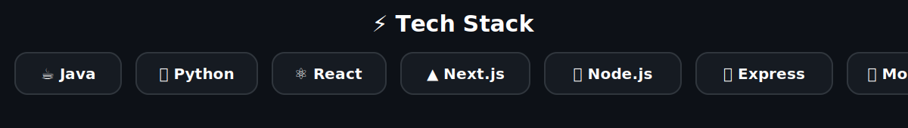

# Hi 👋, I'm Manobala S

<div align="center">

### Software Engineering Student • Full Stack Developer • AI Enthusiast


<p>
<a href="https://manoportfolio-beta.vercel.app"></a>
<a href="https://www.linkedin.com/in/manobala8055/"></a>
<a href="mailto:shankarmanogym@gmail.com"></a>
</p>

</div>

---

## 💫 About Me

- 🎓 Integrated M.Tech Software Engineering @ VIT Vellore
- 💻 Passionate about scalable backend systems and modern web applications
- 🤖 Interested in Artificial Intelligence and Machine Learning
- ☁️ Currently learning Docker, Kubernetes, AWS and System Design
- 🚀 Looking for Software Engineering & Backend Internship opportunities

---

## ⚡ Tech Stack

<p align="center">
  
</p>

# 🚀 Featured Projects

| Project | Description |
|---------|-------------|
| 🏥 **CliniCall** | Healthcare appointment platform using Next.js, Node.js, PostgreSQL, Redis, BullMQ, JWT and CI/CD. |
| 🎬 **MovieHub** | Movie database platform using React, Node.js, Express and MySQL. |
| 🧠 **Parkinson Detection** | AI powered disease detection using PyTorch, Transformers and Streamlit. |

---

# 📊 GitHub Analytics

<p align="center">


</p>

<p align="center">


</p>

---

## 📈 Contribution Graph

<p align="center">

</p>

---

## 🏆 GitHub Trophies

<p align="center">

</p>

---

## 📚 Certifications

- NVIDIA Fundamentals of Deep Learning
- React Certification
- Integrated M.Tech Software Engineering

---

## 🎯 Current Focus

- Backend Engineering
- Distributed Systems
- Cloud Native Applications
- AI Powered Products
- Open Source

---

## 💬 Quote

> *"Programs must be written for people to read, and only incidentally for machines to execute."* — Harold Abelson

---

## 👀 Profile Views

<p align="center">

</p>

---

<div align="center">

### ⭐ Thanks for visiting my profile!

If you like my work, consider giving a ⭐ to my repositories.


</div>

## Optional GitHub Action (Snake Animation)

Create `.github/workflows/snake.yml`:

```yaml
name: Generate Snake

on:
  schedule:
    - cron: "0 */12 * * *"
  workflow_dispatch:

jobs:
  build:
    runs-on: ubuntu-latest
    steps:
      - uses: Platane/snk@v3
        with:
          github_user_name: Mano-8055
          outputs: dist/github-contribution-grid-snake-dark.svg
      - uses: crazy-max/ghaction-github-pages@v4
        with:
          target_branch: output
          build_dir: dist
        env:
          GITHUB_TOKEN: ${{ secrets.GITHUB_TOKEN }}
```
